# Procesverslag
Markdown is een simpele manier om HTML te schrijven.  
Markdown cheat cheet: [Hulp bij het schrijven van Markdown](https://github.com/adam-p/markdown-here/wiki/Markdown-Cheatsheet).

Nb. De standaardstructuur en de spartaanse opmaak van de README.md zijn helemaal prima. Het gaat om de inhoud van je procesverslag. Besteedt de tijd voor pracht en praal aan je website.

Nb. Door *open* toe te voegen aan een *details* element kun je deze standaard open zetten. Fijn om dat steeds voor de relevante stuk(ken) te doen.

## Jij

  
uitwerken voor kick-off werkgroep

  ### Auteur:
  Eme Valentin Diaz Morales

  #### Je startniveau:
  Rood

  #### Je focus:
  Responsive
 

## Je website

  
uitwerken voor kick-off werkgroep

  ### Je opdracht:
  https://www.racerworldwide.net/

  #### Screenshot(s) van de eerste pagina (small screen): 
  Racerworldwide home page
  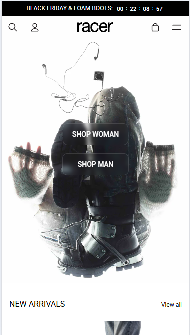

  #### Screenshot(s) van de tweede pagina (small screen):
  Racerworldwide product page
  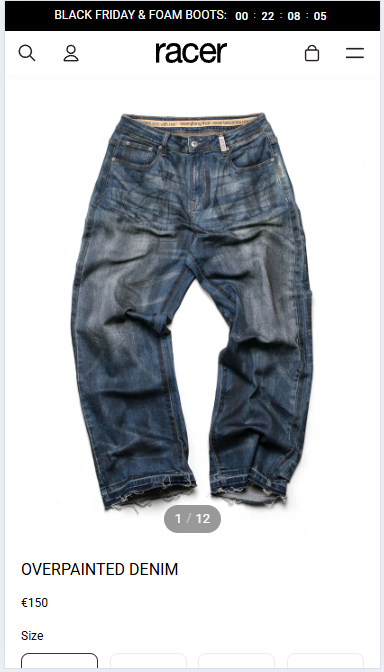
 

## Toegankelijkheidstest 1/2 (week 1)

  
uitwerken na test in 2e werkgroep

  ### Bevindingen
  - Veel errors
  - Heading elements niet in goede volgorde
  - Geen gebruik van transition
  - Geen pauze knop video
  - Bij voorlezen screen reader heb je bij: view all geen idee wat je gaat bekijken
  - Bij tabben worden sommige buttons niet gehighlight

## Breakdownschets (week 1)

  
uitwerken na afloop 3e werkgroep

  ### de hele pagina: 
  

  ### dynamisch deel (bijv menu): 
  

## Voortgang 1 (week 2)

  
uitwerken voor 1e voortgang

  ### Stand van zaken
  hier dit ging goed & dit was lastig (neem ook screenshots op van delen van je website en code)

  ### Header gedeelte pagina: 
  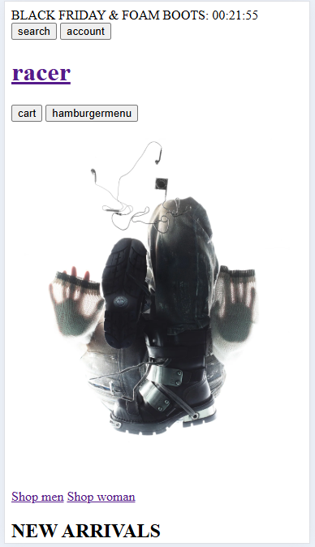

  ### Article: 
  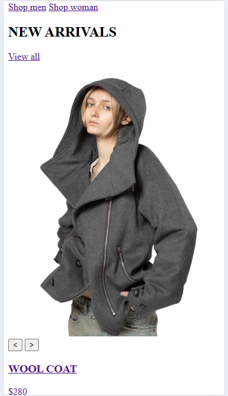

  ### Video: 
  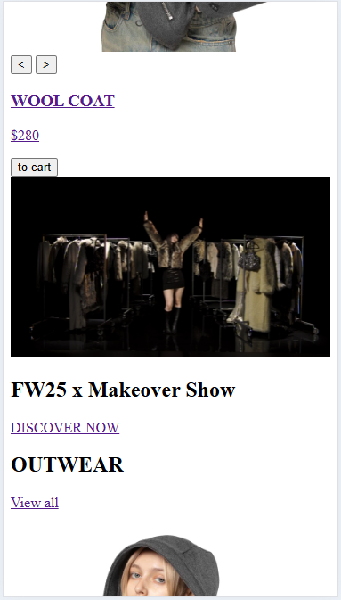

  ### Footer gedeelte pagina: 
  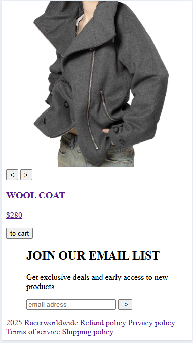

  Wat goed ging: 
   - gelukkig niet alles vergeten over html
   - volgensmij een best goeie basis gecodeerd voor de website (hopelijk semantisch correct)
   - Niet een al te moeilijke pagina om te coderen (denk ik), maar visueel prettig naar te kijken 

  Wat lastig is: 
   - Wanneer moet ik bepaalde html elementen nou precies gebruiken? Wanner list? Hoe nav? Header voor buttons? etc..
   - Wat moet ik functioneel maken?

  ### Agenda voor meeting
  samen met je groepje opstellen

  | Kris           | Anastasia          | Yuzhong      | Eme              |
  | ---            | ---                | ---          | ---              |
  | verloopt goed  | vragen over        |              | Wanneer welke    |
  | alleen vraag   | buttons & headers. | en ik dit    | elementen        |
  | over           | als er tijd is     | nog een punt | gebruiken        |
  | zoekbalk       | hamburgermenu      | ...          | ...              | 

  ### Verslag van meeting
  hier na afloop snel de uitkomsten van de meeting vastleggen

  - H1 beste maken op welke pagina je je bevind
  - Wat algemene punten over html
  - nog een punt
  - ...

## Voortgang 2 (week 3)

  
uitwerken voor 2e voortgang

  ### Stand van zaken
  hier dit ging goed & dit was lastig (neem ook screenshots op van delen van je website en code)

  ### Agenda voor meeting
  samen met je groepje opstellen

  | student 1      | student 2          | student 3    | Eme              |
  | ---            | ---                | ---          | ---              |
  | dit bespreken  | en dit             | en ik dit    | Ul's gebruiken?  |
  | en dat ook nog | dit als er tijd is | nog een punt | Hoe kan ik de    |
  |                |                    |              | grid layout het  |
  |                |                    |              | beste aanpakken  |
  | ...            | ...                | ...          | ...              |

  ### Verslag van meeting
  hier na afloop snel de uitkomsten van de meeting vastleggen

  - Inderdaar ul en li items gebruiken voor de artiekelen
  - Grid template met fractions beste voor grid layout
  - nog een punt
- ...

## Toegankelijkheidstest 2/2 (week 4)

  
uitwerken na test in 9e werkgroep

  ### Bevindingen
  Lijst met je bevindingen die in de test naar voren kwamen (geef ook aan wat er verbeterd is):
  - Aria labels gebruiken voor buttons en links die op zich zelf niet genoeg context bieden
  - Video stond nog op autoplay
  -
  - Heading levels in orde
  - Code semantisch correct (geen errors meer)
  - Focus states toegevoegd

## Voortgang 3 (week 4)

  
uitwerken voor 3e voortgang

  ### Stand van zaken
  hier dit ging goed & dit was lastig (neem ook screenshots op van delen van je website en code)

  ### Agenda voor meeting
  samen met je groepje opstellen

  | student 1      | student 2          | student 3    | student 4        |
  | ---            | ---                | ---          | ---              |
  | dit bespreken  | en dit             | en ik dit    | en dan ik dat    |
  | en dat ook nog | dit als er tijd is | nog een punt | dit wil ik zeker |
  | ...            | ...                | ...          | ...              |

  ### Verslag van meeting
  hier na afloop snel de uitkomsten van de meeting vastleggen

  - punt 1
  - punt 2
  - nog een punt
  - ...

## Eindgesprek (week 5)

  
uitwerken voor eindgesprek

  ### Je uitkomst - karakteristiek screenshots:
  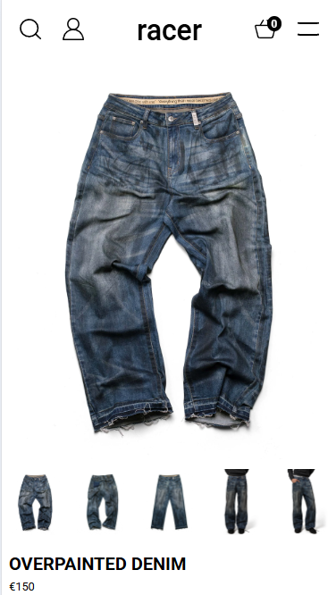
  
  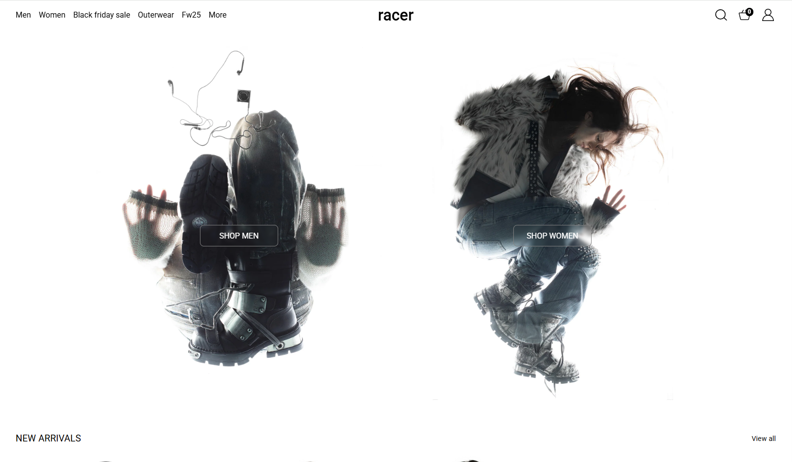
  

  ### Dit ging goed/Heb ik geleerd: 
  Korte omschrijving met plaatjes
  
  Ik heb vooral geleerd hoe ik een website responsive kan maken aan de hand van flexbox en grid. Dit vond ik best moeilijk bij coderen vorig jaar dus ik ben blij dat ik het nu beter kan.

  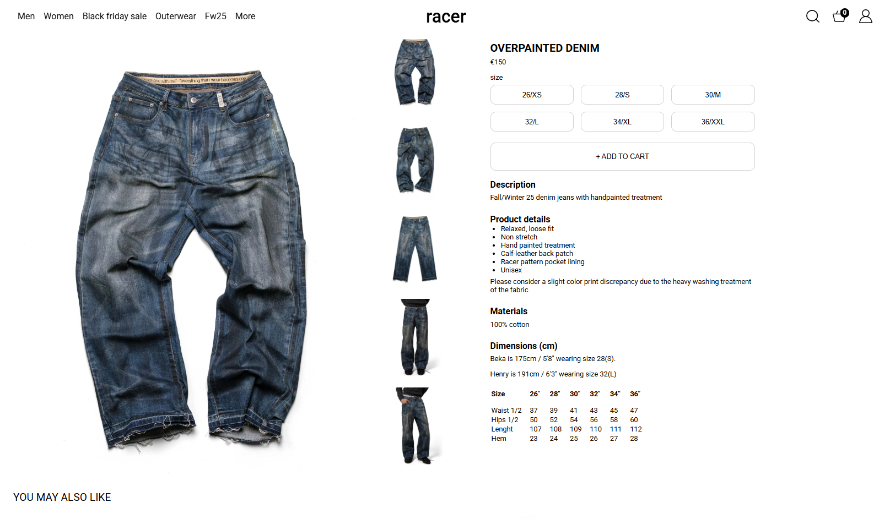
  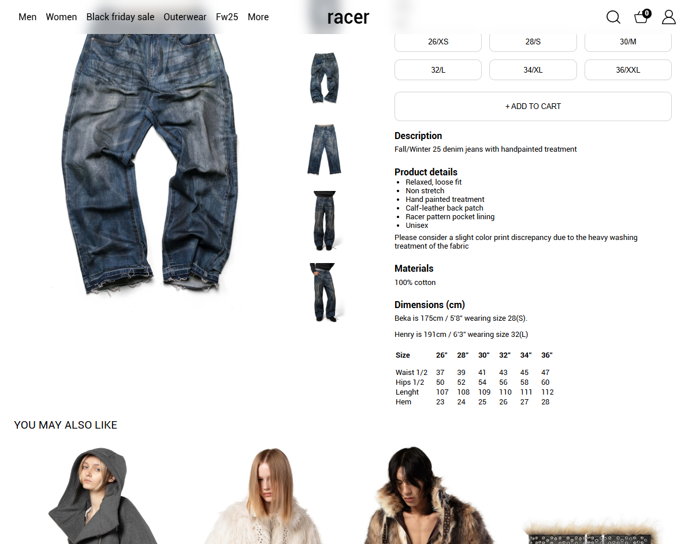
  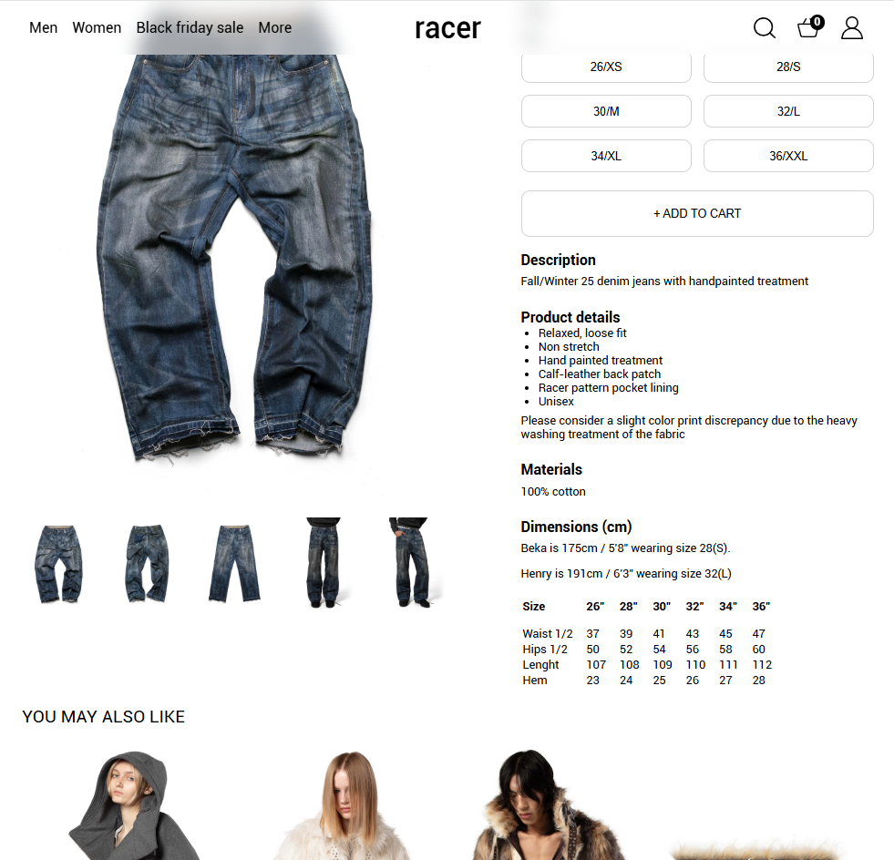
  

  ### Dit was lastig/Is niet gelukt:
  Eigenlijk is alles wat ik wou doen wel gelukt. Ik wou eigenlijk eerst een hamburgermenu maken maar dat vond ik een beetje moeilijk om op mijn eigen pagina toe te passen dus heb ik maar de add to cart gemaakt. 

## Bronnenlijst

  
continu bijhouden terwijl je werkt

  Nb. Wees specifiek ('css-tricks' als bron is bijv. niet specifiek genoeg). 
  Nb. ChatGpT en andere AI horen er ook bij.
  Nb. Vermeld de bronnen ook in je code.

  1. Flexbox oefening 2, link: https://codepen.io/shooft/live/wBKyoWx
  2. Grid oefening 3, link: https://codepen.io/shooft/pen/ogjpvYo
  3. JS - Oefening 3, link: https://codepen.io/shooft/pen/raOpRBm

